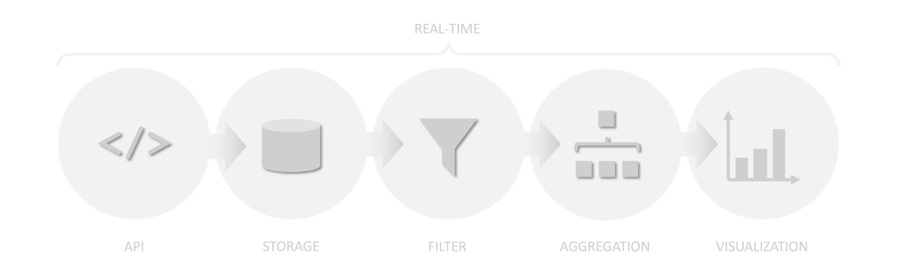

# LiveBoards


**LiveBoards** allows real-time visualization of your data as events occur, using one single application. Events are published using a RESTful API and stored into an in-memory database loosely following a tabular format familiar from relational databases. Changes in the database are immediately picked up by the filter and aggregation pipelines, and results are calculated on-the-fly for every set of defined boards (views) to your data. Completed results, again, are immediately pushed to boards where visualizations are automatically updated, without the need for any interaction.



## Running

**Note!** Examples for MacOS, Unix, & Linux.

**Requirements**

- Make sure you have Java Development Kit version **17** or newer installed
- Make sure you have Apache Ant **1.10** or newer installed

**Instructions**

1. Clone this repository (and check out a specific version if needed):
   ```
   $ git clone https://github.com/rtswstudio/LiveBoards
   $ cd LiveBoards
   ```
2. Compile the code and create a distribution package:
   ```
   $ ant clean
   $ ant
   ```
3. Modify the `dist/liveboards-config.json` if needed (see schema and example below)
4. Start the application (`CTRL-C` to stop):
   ```
   $ cd dist
   $ sh ./run.sh
   ```
5. Check system health using `curl` (or open the URL in your browser):
   ```
   $ curl "http://localhost:8888/api/1/health"
   ```
   You should see something resembling:
   ````json
   {
    "boards": {
      "count": 3
    },
    "tables": {
      "count": 3
    },
    "memory": {
      "free": 56280800,
      "total": 83886080,
      "max": 8589934592
    }
    ,
    "version": "0.1",
    "processors": {
      "available": 16
    },
    "time": "24.09.2023 20:02:36"
   }
   ````
6. Start creating tables and boards:
   - Example tables are found under `examples/tables`
   - Example boards are found under `examples/boards`
   - Example data push clients are found under `examples`

## Configuration

**Schema**

````json
{
  "$schema": "http://json-schema.org/draft-07/schema#",
  "type": "object",
  "properties": {
    "server": {
      "type": "object",
      "properties": {
        "host": {
          "type": "string"
        },
        "port": {
          "type": "integer"
        }
      }
    },
    "tables": {
      "type": "object",
      "properties": {
        "path": {
          "type": "string"
        }
      }
    },
    "boards": {
      "type": "object",
      "properties": {
        "path": {
          "type": "string"
        }
      }
    }    
  },
  "required": ["server"]
}
````

**Example**

````json
{
  "server": {
    "host": "127.0.0.1",
    "port": 8888
  },
  "tables": {
    "path": "examples/tables"
  },
  "boards": {
    "path": "examples/boards"
  }
}
````

## Concepts

Concepts can be best explained by introducing a real use case. Let's say we want a pie chart to show the distribution of used browsers, for example based on some web server log feed. The next sections will show how to configure this in **LiveBoards**.

### Tables

Tables define the data structures in the in-memory database to hold our data. The model is familiar from traditional relational databases; **tables** contain **columns** with fixed **types**.

**Schema**

````json
{
  "$schema": "http://json-schema.org/draft-07/schema#",
  "type": "object",
  "properties": {
    "name": {
      "type": "string"
    },
    "columns": {
      "type": "array",
      "items": {
        "type": "object",
        "properties": {
          "name": {
            "type": "string"
          },
          "type": {
            "type": "string",
            "enum": ["string", "integer", "decimal", "boolean", "timestamp"]
          }
        },
        "required": ["name", "type"]
      }
    }
  },
  "required": ["name", "columns"]
}
````

For our example, we will configure a `browsers` table. It will have columns to hold a row identifier, the name of the browser, as well as a timestamp for the event.

**Example**

````json
{
  "name": "browsers",
  "columns": [
    {
      "name": "id",
      "type": "integer"
    },
    {
      "name": "name",
      "type": "string"
    },
    {
      "name": "time",
      "type": "timestamp"
    }
  ]
}
````

### Boards

Boards define the views to our data. Each board contains a single visualization, defined by a **label** (*what to measure*) and calculated **values** (*how to measure*). Optional **filters** can be defined to reduce the amount of data published to boards.

**Schema**

````json
{
  "$schema": "http://json-schema.org/draft-07/schema#",
  "type": "object",
  "properties": {
    "name": {
      "type": "string"
    },
    "type": {
      "type": "string",
      "enum": ["pie", "bar", "line"]
    },
    "label": {
      "type": "object",
      "properties": {
        "title": {
          "type": "string"
        },
        "table": {
          "type": "string"
        },
        "column": {
          "type": "string"
        }
      },
      "required": ["table", "column"]
    },
    "values": {
      "type": "array",
      "items": {
        "type": "object",
        "properties": {
          "table": {
            "type": "string"
          },
          "column": {
            "type": "string"
          },
          "aggregate": {
            "type": "string",
            "enum": ["count", "distinct", "sum", "minimum", "maximum", "average", "first", "last", "range", "mode"]
          },
          "category": {
            "type": "string"
          }
        },
        "required": ["table", "column", "aggregate", "category"]
      }
    },
    "filters": {
      "type": "array",
      "items": {
        "type": "object",
        "properties": {
          "type": {
            "type": "string",
            "enum": ["head", "tail", "match"]
          },
          "properties": {
            "type": "object",
            "properties": {
              "table": {
                "type": "string"
              },
              "column": {
                "type": "string"
              },
              "operation": {
                "type": "string",
                "enum": ["above", "below", "equals"]
              },
              "value": {
                "oneOf": [
                  {
                    "type": "string"
                  },
                  {
                    "type": "integer"
                  },
                  {
                    "type": "decimal"
                  },
                  {
                    "type": "boolean"
                  }
                ]
              }
            },
            "required": ["value"]
          },
          "required": ["type", "properties"]
        }
      }
    }
  },
  "required": ["name", "type", "label", "values"]
}
````

See *References* for more information on aggregate functions and filters.

For our example, we will configure a `browsers` board, and display results using a **pie chart**. For the **label**, we will use the `name` column previously introduced in our table. For each label, we will **count** the number of occurrences based on the `id` column from the same table.

**Example**

````json
{
  "name": "browsers",
  "type": "pie",
  "label": {
    "title": "Browser",
    "table": "browsers",
    "column": "name"
  },
  "values": [
    {
      "table": "browsers",
      "column": "id",
      "aggregate": "count",
      "category": "Count"
    }
  ],
  "filters": [
  ]
}
````

## API

### Summary

| Method   | URI                                 | Description                          |
|----------|-------------------------------------|--------------------------------------|
| `GET`    | `/api/[VERSION]`                    | OpenAPI 2.0 compliant API definition |
| `GET`    | `/api/[VERSION]/health`             | Health check                         |
| `POST`   | `/api/[VERSION]/boards`             | Create new board                     |
| `GET`    | `/api/[VERSION]/boards`             | List board names                     |
| `GET`    | `/api/[VERSION]/boards/[NAME]`      | Render board in HTML                 |
| `DELETE` | `/api/[VERSION]/boards/[NAME]`      | Delete existing board                |
| `POST`   | `/api/[VERSION]/tables`             | Create new table                     |
| `GET`    | `/api/[VERSION]/tables`             | List table names                     |
| `DELETE` | `/api/[VERSION]/tables/[NAME]`      | Delete existing table                |
| `POST`   | `/api/[VERSION]/tables/[NAME]/rows` | Add new row to existing table        |

## Reference

### Aggregate Functions

| Name        | Description                                                   | Accepted Types                    |
|-------------|---------------------------------------------------------------|-----------------------------------|
| `count`     | Return ther number of elements                                | All                               |
| `distinct`  | Return the number of unique elements                          | All                               |
| `sum`       | Return the sum of all elements                                | `integer`, `decimal`              |
| `minimum`   | Return the element with the minimum value                     | `integer`, `decimal`, `timestamp` |
| `maximum`   | Return the element with the maximum value                     | `integer`, `decimal`, `timestamp` |
| `average`   | Return the average value of all elements                      | `integer`, `decimal`              |
| `first`     | Return the first occurred element                             | All                               |
| `last`      | Return the last occurred element                              | All                               |
| `mode`      | Return the element which occurs the most                      | `integer`, `decimal`              |
| `range`     | Return the difference between the minimum and maximum element | `integer`, `decimal`              |

### Filters

| Name | Description                                    | Parameters                                                                                                                                                                                                  |
|------|------------------------------------------------|-------------------------------------------------------------------------------------------------------------------------------------------------------------------------------------------------------------|
| `head` | Return elements from the start of the series | - `value`: the number of elements                                                                                                                                                                           |
| `tail` | Return elements from the end of the series   | - `value`: the number of elements                                                                                                                                                                           |
| `match` | Return elements matching a certain criteria | - `table`: the table to match<br/>- `column`: the column in the table to match<br/>- `operation`: the operation to apply for matching values (`above`, `below`, `equals`)<br/>- `value`: the value to match |

## Dependencies

- [Chart.js](https://github.com/chartjs/Chart.js): Used to render visualizations, licensed under the [MIT License](https://github.com/chartjs/Chart.js/blob/master/LICENSE.md)
